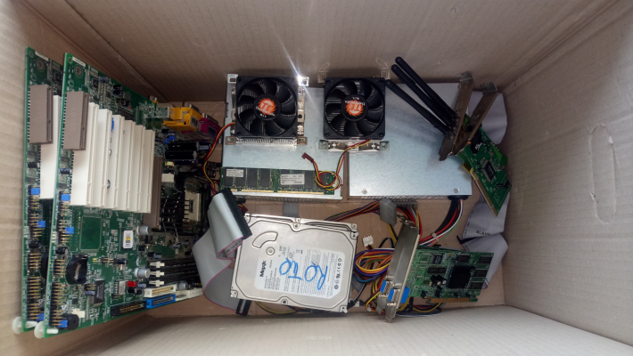

# PC e COMPONENTI

## Sintesi dell'attività
- **Discussione** PC architettura e periferiche, unità di misura digitali
- **Attività manuale** montaggio di un PC dati i componenti (vecchi Pentium4 smontati)
- **Attività a PC** attività conclusiva con Kahoot o LearningApps
- **Prodotto finale** //

## Dettagli dell'attività

